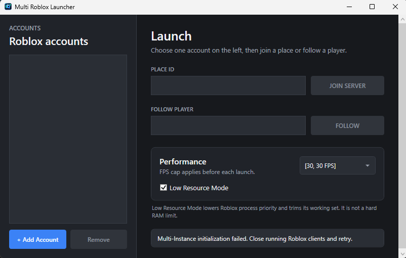

# Multi Roblox Launcher

**Closed Source • Windows 10/11 x64**

Multi Roblox Launcher is a portable Windows launcher for using multiple Roblox accounts and keeping multiple Roblox clients open at the same time.

## Features

- Add and save multiple Roblox accounts
- Keep multiple Roblox clients open at once
- Join games directly with a Place ID
- Follow / join another Roblox player
- Working FPS limiter
- Low Resource Mode for reduced CPU and RAM usage
- Portable — no installer required
- No separate .NET installation required

## Preview

## Requirements

- Windows 10 or Windows 11 x64
- **The normal Roblox desktop player must already be installed**

## Security

Roblox passwords are **never stored**.

Saved Roblox account sessions are stored locally and encrypted for the current Windows user.

**IMPORTANT: Never share your `Data` folder with anyone. It contains your locally saved account sessions.**

The launcher uses the normal Roblox desktop client and does **not** use DLL injection, exploits, or modified Roblox files.

## Download

Download the latest version from the **Releases** section of this repository.

Current release:

`MultiRobloxLauncher-v1.0.7-win-x64.zip`

## VirusTotal

**ZIP:**  
https://www.virustotal.com/gui/file/8ed7a2738de19566f5b110e5771b8e7820158653fd1ea6b39138e645aeeb4cef

**EXE:**  
https://www.virustotal.com/gui/file/24070f346a9b7504beee03362612fc8bcf1071f6bb309bd6e54ad56b133a09c2

You are also free to upload the downloaded ZIP or EXE to VirusTotal yourself before running it.

## Usage

1. Download the latest Windows x64 ZIP from Releases.
2. Extract the ZIP.
3. Close any running Roblox clients before the first start.
4. Run `Multi Roblox Launcher.exe`.
5. Click **Add Account** and sign in on the official Roblox website.
6. Select an account, enter a Place ID, then click **Join Server**.
7. To join another player, enter their Roblox username and click **Follow**.

## Closed Source

Multi Roblox Launcher is proprietary software.

The source code is **not public** and is not included in this repository.

See [LICENSE](LICENSE) for usage and redistribution terms.

## Disclaimer

Multi Roblox Launcher is an independent project and is not affiliated with, endorsed by, or sponsored by Roblox Corporation.

## Publisher

**amvu**

GitHub: **@EmirCoco37**
