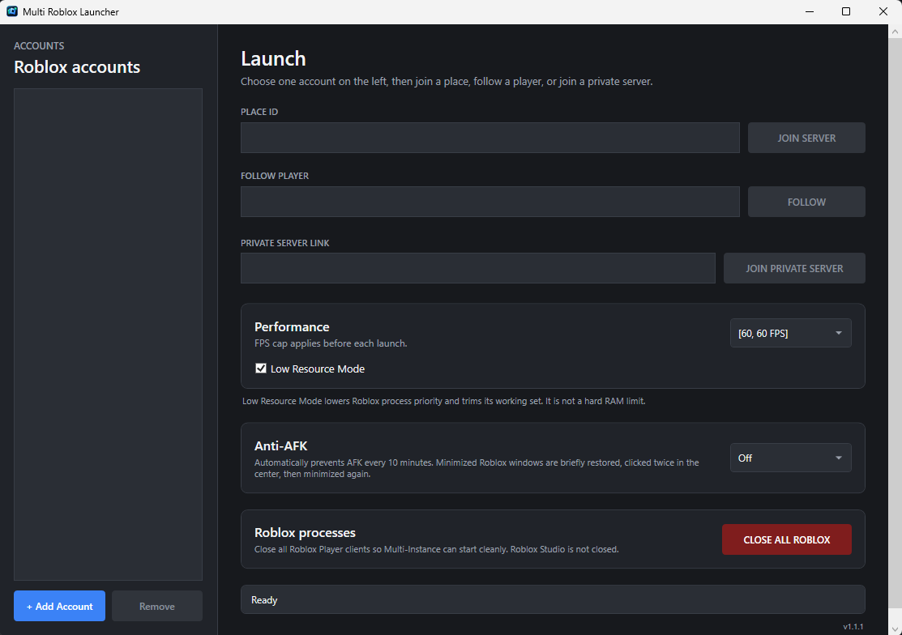

# Multi Roblox Launcher

**Closed Source • Windows 10/11 x64**

Portable Windows launcher for managing multiple Roblox accounts and running multiple Roblox clients at the same time.

## Features

- Multiple saved Roblox accounts
- Multi-instance Roblox support
- Join by Place ID
- Join private servers via link
- Follow / join another player
- Anti-AFK with automatic 10-minute cycles
- FPS limiter
- Low Resource Mode
- Close all Roblox Player clients
- Built-in Auto Updater
- No installer required

## Preview

## Download

➡️ **[Download the latest release](https://github.com/EmirCoco37/MultiRobloxLauncher/releases/latest)**

## Updating

### Moving from an older version to v1.1.1

If you already have accounts saved, copy your old **`Data`** folder into the new v1.1.1 folder once.

Starting with v1.1.1, future updates are handled by the built-in **Auto Updater**, so you will not need to copy the `Data` folder again.

## Usage

1. Download and extract the latest Windows x64 ZIP.
2. Close all Roblox clients and fully exit Roblox from the Windows system tray.
3. Run `Multi Roblox Launcher.exe`.
4. Click **Add Account** and log in through the official Roblox website.
5. Select an account and use:
   - **Join Server** with a Place ID
   - **Private Server Link**
   - **Follow**
6. Optionally enable **Anti-AFK** and **Low Resource Mode**.

> If you experience lag spikes after running Roblox for a few hours, try using **60 FPS instead of 30 FPS**. This will not affect Low Resource Mode.

## Anti-AFK

Anti-AFK runs immediately when enabled and then repeats every **10 minutes**.

Minimized Roblox windows are automatically restored, handled, and minimized again.

## Security

Roblox passwords are **never stored**.

Saved account sessions are stored locally and encrypted for the current Windows user.

Login is performed through the **official Roblox website**.

> **Never share your `Data` folder. It contains your locally saved account sessions.**

The launcher does not use DLL injection, exploits, or modified Roblox files.

## Requirements

- Windows 10 or Windows 11 x64
- Roblox desktop player installed

## Closed Source

Multi Roblox Launcher is proprietary software.

The source code is not public and is not included in this repository.

See [LICENSE](LICENSE) for usage and redistribution terms.

## Disclaimer

Multi Roblox Launcher is an independent project and is not affiliated with, endorsed by, or sponsored by Roblox Corporation.

## Publisher

**amvu**  
GitHub: **@EmirCoco37**
