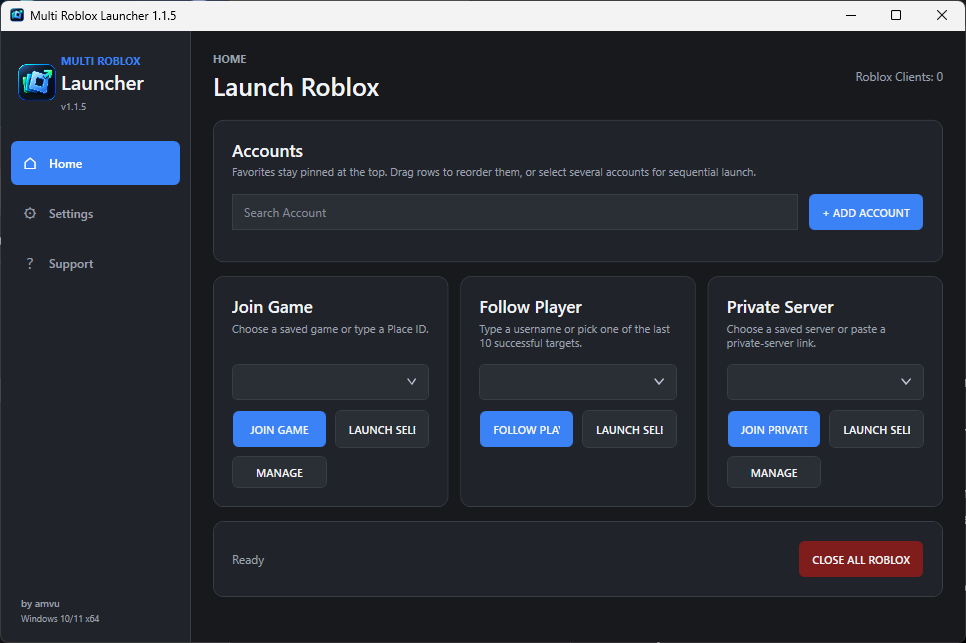
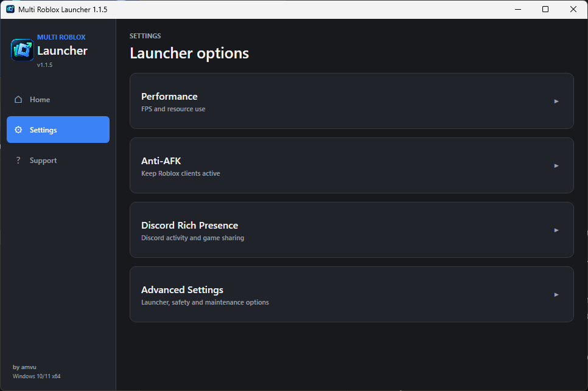
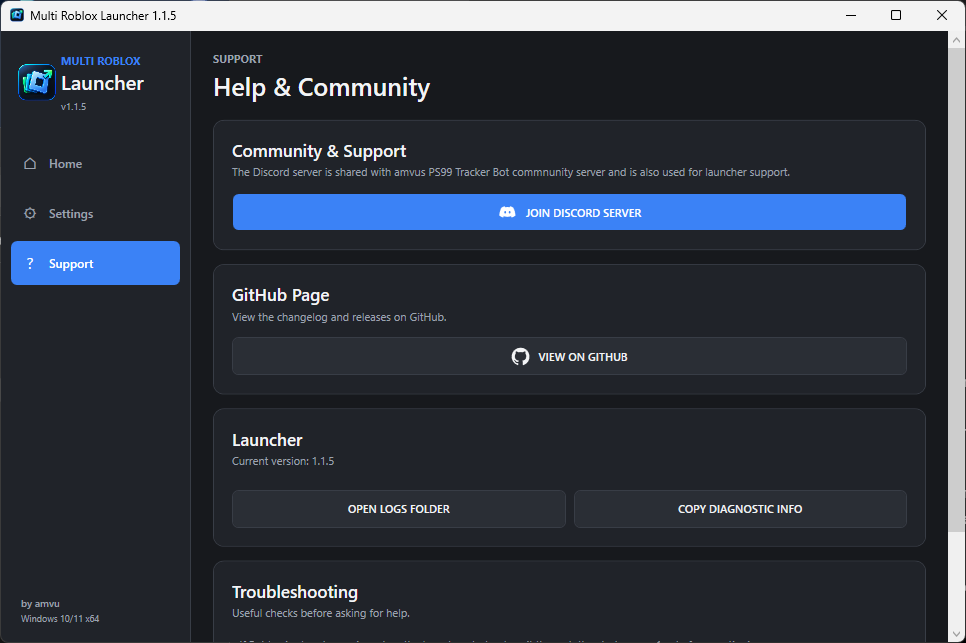

# Multi Roblox Launcher

**Closed Source | Windows 10/11 x64**

A portable Windows launcher for managing multiple Roblox accounts and running multiple Roblox clients at the same time.

## Features

- **Account Management** - Avatars, nicknames, favorites, sorting, search and history.
- **Multi-Instance & Smart Launch Queue** - Run multiple clients with automatic launch sequencing.
- **Launch Options** - Join by Place ID, follow players or use private server links.
- **Saved Games & Servers** - Manage presets with automatic game name detection.
- **Live Account Status** - View online accounts and their current games.
- **Discord Rich Presence** - Display your game, client count and session timer.
- **Window Manager** - Compact, grid and custom window layouts.
- **Performance Controls** - Custom FPS limits and minimum graphics mode.
- **Anti-AFK** - Click or Jump every 1-15 minutes, including minimized windows.
- **Utilities & Recovery** - History, system tray, diagnostics, settings backup and updater rollback.

## Preview

<strong>View more screenshots (Settings & Support)</strong>

### Settings

### Support

## Download

**[Download the latest release](https://github.com/EmirCoco37/MultiRobloxLauncher/releases/latest)**

No installer required. Download and fully extract the Windows x64 ZIP.

## Updating

The built-in updater checks for new releases when you open the launcher. If no update prompt appears, use **Settings → Check for Updates**.

Your accounts, settings, `Data` and `Logs` are preserved during automatic updates.

**Updating manually?** Extract the new release and copy your existing `Data` folder into the new launcher folder to keep your saved accounts and settings.

## Usage

1. [Download and extract the latest Windows x64 ZIP](https://github.com/EmirCoco37/MultiRobloxLauncher/releases/latest).
2. Close any running Roblox clients before starting the launcher.
3. Run `Multi Roblox Launcher.exe`.
4. Click **Add Account** and sign in through the official Roblox website.
5. Select one or more accounts and choose **Join Game**, **Follow Player** or **Private Server**.
6. Optionally customize your FPS limit, Anti-AFK and Low Resource Mode under **Settings**.

> **Tip:** If you notice lag spikes after running Roblox for several hours, try a 60 FPS limit instead of 30 FPS.

## Security

- Roblox passwords are **never stored** by the launcher.
- Saved account sessions are stored locally and encrypted for your Windows user account.
- Sign-in is performed through the **official Roblox website**.
- Settings exports do not include account sessions.
- The launcher does not use DLL injection, exploits or modified Roblox files.

> **Never share your `Data` folder.** It contains your locally saved account sessions.

## Requirements

- Windows 10 or Windows 11 (64-bit)
- Roblox desktop player installed
- Internet connection for login, updates and Roblox services

## Closed Source

Multi Roblox Launcher is proprietary software. Its source code is not public and is not included in this repository. See [LICENSE](LICENSE) for usage and redistribution terms.

## Disclaimer

Multi Roblox Launcher is an independent project and is not affiliated with, endorsed by or sponsored by Roblox Corporation.

## Publisher

Discord: **@amvu**  
GitHub: **@EmirCoco37**
